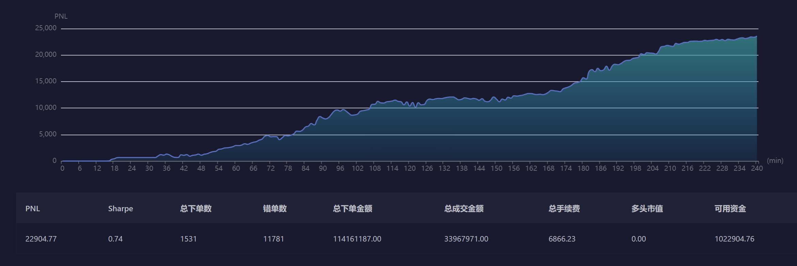

# High Frequency Trading System for Ubiquant Competition
This repository is dedicated to a sophisticated high-frequency trading (HFT) system developed for the Ubiquant competition. Unlike traditional market-neutral strategies, this system is engineered to capitalize on short-term market inefficiencies by processing and **reacting to tick data within 100 milliseconds**. The core of this system is built on asynchronous programming and multiprocessing techniques, enabling it to handle rapid streams of trading data and execute trades at an exceptionally high speed.

## Features
- **Asynchronous Data Handling**: Utilizes Python's asyncio library to manage simultaneous data streams and API calls without blocking, ensuring real-time data processing and decision-making.
- **Multiprocessing for Speed**: Implements multiprocessing to distribute data processing and model prediction tasks across multiple CPU cores, significantly enhancing computation speed.
- **Compliance with Rate Limits**: Designed to operate within the Ubiquant competition's strict API call rate limits (3000 calls every 10 seconds for Limit Order Book (LOB) updates, among others), ensuring uninterrupted operation.

## System Structure
```
Ubiquant High Frequency Trading System
|
├── main.py - Entry point, orchestrates the bot's operation cycle.
|
├── Neutralizer_Bot.py - Executes neutralization strategy to clear positions.
|
├── broker.py - Manages interactions with the brokerage, including orders and trades.
|   |
|   ├── submit_order() - Submits trading orders(market, best bid/ask), with detailed parameters.
|   |
|   ├── cancel_order() - Cancels existing orders via the trading API.
|   |
|   ├── get_trade_info() - Retrieves trade execution details asynchronously.
|   |
|   └── risk_management_all() - Applies risk management strategies across all trades.
|
├── data_manager.py - Handles data retrieval and management, serving as a data backbone.
|   |
|   ├── update_lob() - Asynchronously updates the Limit Order Book (LOB) data.
|   |
|   ├── fetch_stock_data() - Asynchronously fetches and processes stock data for individual stock.
|   |
|   └── get_model_data() - Prepares and outputs trading data for strategy analysis.
|
├── position_manager.py - Manages positions, leveraging data_manager for historical data.
|   |
|   ├── update_position() - Updates positions with execution details of new trades.
|   |
|   ├── calculate_pnl() - Calculates current profit and loss, adjusting positions accordingly.
|   |
|   └── calibrate() - Recalculates realized/unrealized PnL, position sizes, average prices based on trade information.
|
├── strategy.py - Encapsulates the trading strategy, making decisions based on data inputs.
|   |
|   ├── trade_decision_all() - Decision-making process for all available stocks.
|   |
|   └── trade_decision_stock() - Executes trading decisions for individual stocks.
|
├── trade_mgmt.py - Contains classes for managing trades and orders, and storing LOB data.
|   |
|   ├── Order - Represents trading orders with execution logic.
|   |
|   ├── Trade - Manages trade details post-execution.
|   |
|   └── StockData - Retains LOB data for the last 100 ticks for analysis.
|
├── interface.py - Facilitates API communication with the trading platform for data and orders.
|   |
|   ├── send_order() - Interface method to send orders to the market.
|   |
|   └── get_market_data() - Retrieves and processes market data from the trading platform.
```

## Strategy and Model Insights
Our trading strategy harnesses the power of high-frequency data, specifically focusing on the Limit Order Book (LOB) to pinpoint short-term trading opportunities. We analyze 30-50 imbalance factors derived from the LOB, which provide a granular view of market dynamics and trader behavior at a given moment. These factors are crucial for understanding the supply and demand imbalances that can lead to price movements.

The core analytical tool in our strategy is an optimized LightGBM model, trained to synthesize these imbalance factors into actionable insights. This model is tailored to predict the direction of stock price movements in the next 15 to 30 seconds, a customized target variable that aligns with our high-frequency trading goals. The LightGBM model's speed and efficiency in processing these signals make it an invaluable asset, enabling our strategy to capitalize on fleeting market opportunities with precision and agility. By leveraging this sophisticated approach, our trading system is designed to navigate the complexities of the market, executing trades that harness short-term price fluctuations for potential profit.


## Select Round Performance


## Further Improvements
Our high-frequency trading system, while efficient, has areas for enhancement to boost performance and stability:

- **Model Overfitting**: The LightGBM model, pivotal for predicting stock movements, risks overfitting to current market data. Implementing advanced validation and regularization methods could mitigate this, ensuring more consistent performance across different market conditions.

- **Unrealized PnL Calculation**: Accurate computation of unrealized profit and loss (PnL) is challenging during volatile market swings. Improving these calculations will offer a more accurate financial overview, aiding better decision-making.

- **Risk Management**: Current risk management strategies need strengthening, especially in minimizing losses during significant drawdowns. Developing sophisticated risk mitigation algorithms will enhance the system's resilience against adverse market trends.

- **Target Variable Design**: The target variable that guides the predictive model could be refined. A more accurately designed target variable, possibly incorporating a broader range of market indicators, will improve the model's comprehension of stock price movements and stability.

Addressing these areas will not only enhance the system's accuracy and reliability but also ensure sustained competitive performance in high-frequency trading environments.